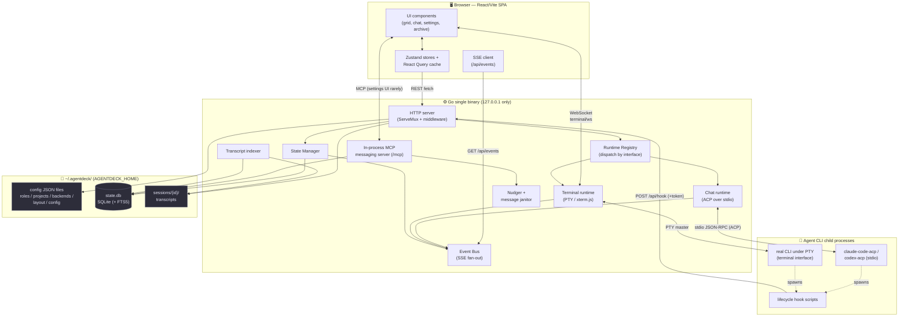
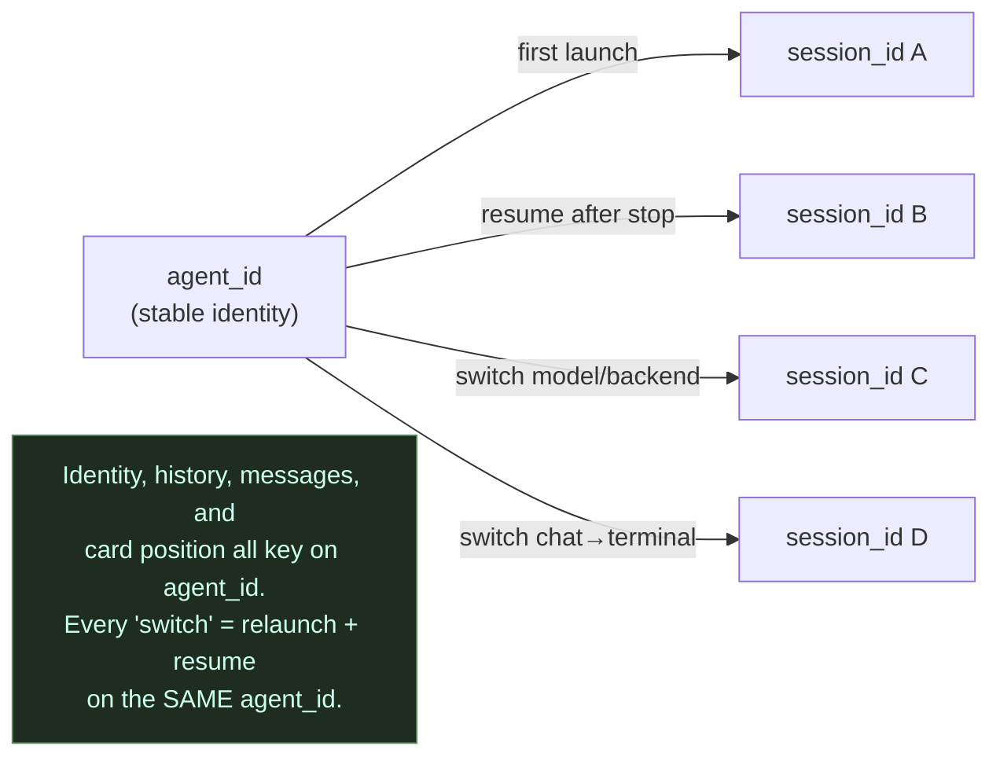
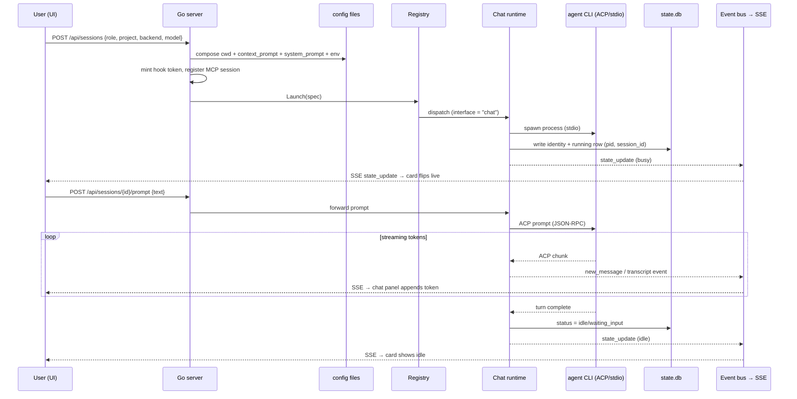
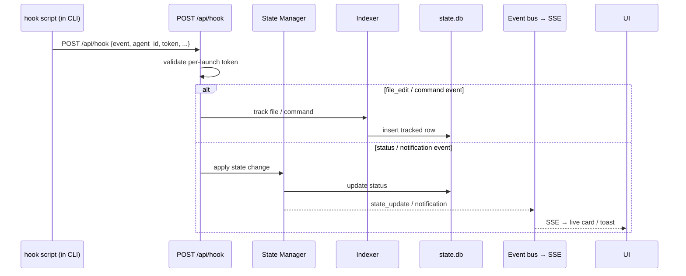
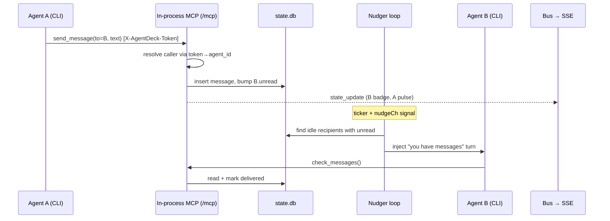
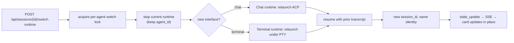
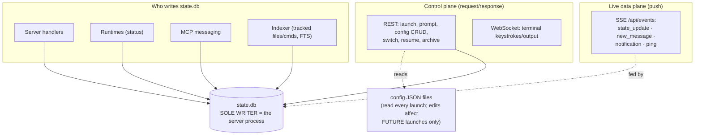
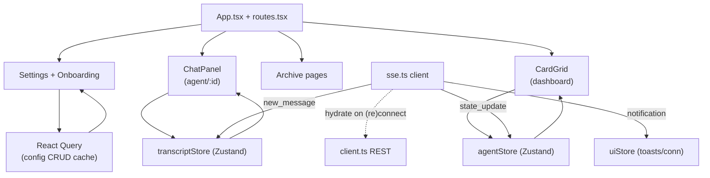

# AgentDeck — Architecture & Flows

A high-level onboarding map of how AgentDeck fits together: the moving pieces,
how they talk, and the main happy-path flows. Read this alongside
[MAP.md](MAP.md) (planning-doc index) and
[docs/agent-dashboard-prd.md](docs/agent-dashboard-prd.md) (master spec).

## One-paragraph mental model

AgentDeck is a **local dashboard for launching and orchestrating coding agents**
(Claude Code, Codex). It ships as a **single Go binary** that serves an embedded
**React UI** and a `127.0.0.1`-only **REST + SSE API**. The Go server spawns each
agent as a child **CLI process** and talks to it over **stdio (ACP)** for chat,
or a **PTY** for terminal. Config is **hand-editable JSON files**; machine state
is a **SQLite database the server alone writes**. Agents report progress back
through **lifecycle hooks that POST to the server**, and agents coordinate with
each other through an **in-process MCP messaging server** hosted inside the same
binary. The UI stays live via a single **Server-Sent Events** stream.

---

## 1. System landscape

The whole product is two long-lived processes (the browser UI and the Go binary)
plus one child process per running agent. Everything binds to loopback; there is
no cloud, no auth, no runtime Node or Python.

**Why it's shaped this way** (see
[docs/architecture-decisions.md](docs/architecture-decisions.md)):

- **Config = files, state = SQLite.** JSON is hand-editable and git-friendly;
  machine state needs transactional integrity and a single writer.
- **Server is the sole SQLite writer.** No multi-process contention, no
  derived-index drift. Producers (hooks, runtimes) and consumers (UI via SSE)
  are decoupled through the server.
- **MCP hosted in-process.** No separate Node sidecar — `list_agents`,
  `send_message`, `check_messages` are direct reads/writes of `state.db`.

---

## 2. The load-bearing identity concept

Everything that "switches" (model, backend, chat↔terminal) hinges on one rule:

> **A stable `agent_id` survives; the CLI's `session_id` is ephemeral.**

Get this wrong and resume/clone/switch all break. It is established in the data
model in [internal/state](internal/state) and threaded through the registry.

---

## 3. Component responsibilities

| Layer | Package / path | Responsibility |
|---|---|---|
| **CLI** | [internal/cli](internal/cli), [cmd/agentdeck](cmd/agentdeck/main.go) | `dashboard start/stop/open`, pidfile, launch syntax |
| **HTTP server** | [internal/server](internal/server) | Routes ([routes.go](internal/server/routes.go)), handlers, CORS/log middleware, static UI, hook endpoint, SSE endpoint |
| **Runtime registry** | [internal/runtime](internal/runtime) | Dispatch launch/control to the right runtime by `agent.interface` |
| **Chat runtime** | [chat.go](internal/runtime/chat.go), [acpmap.go](internal/runtime/acpmap.go), [hub.go](internal/runtime/hub.go) | Spawn ACP CLI, JSON-RPC over stdio, normalize events, write status |
| **Terminal runtime** | [internal/runtime/terminal](internal/runtime/terminal) | Real CLI under a PTY, bridged to xterm.js over WebSocket |
| **State** | [internal/state](internal/state) | SQLite schema, agents/running/messages/sessions, **sole writer** |
| **Event bus** | [internal/bus](internal/bus) | Fan normalized events out to all SSE clients with a seq + snapshot |
| **Messaging MCP** | [internal/messaging](internal/messaging) | In-process MCP server; token→agent_id identity binding |
| **Hooks** | [internal/hooks](internal/hooks) | Lifecycle scripts + per-agent CLI settings file |
| **Index / transcript** | [internal/index](internal/index), [internal/transcript](internal/transcript) | Write transcripts, index them into FTS5 for archive search |
| **Config** | [internal/config](internal/config) | Load/validate/seed the JSON file store; atomic writes |
| **UI** | [ui/src](ui/src) | React SPA: card grid, chat panel, onboarding, settings, archive |

---

## 4. Happy flow — launching an agent & streaming a chat

The core loop: the user picks role + project + backend, the server spawns the
CLI, and tokens/output flow back live.

Key detail: the UI never polls the CLI. **All liveness flows through the single
`/api/events` SSE stream** (event types: `state_update`, `new_message`,
`notification`, `ping`). REST is request/response for actions; SSE is the live
push channel.

---

## 5. Happy flow — hooks reporting status back

Agents (especially terminal agents) report lifecycle events by POSTing to the
server. This is the **producer side** that decouples agents from the UI.

The per-launch **token** is minted at launch ([launch.go](internal/server/launch.go))
and passed to the CLI via `AGENTDECK_HOOK_*` env vars. A reconciliation watcher
over `sessions/` exists as a **fallback only** — hooks are the primary path.

---

## 6. Happy flow — agent-to-agent messaging & the nudger

Agents coordinate through MCP tools that read/write `state.db` directly. An idle
recipient is woken by the **nudger**.

Identity is **bound to the registered MCP session token, never to a tool
argument** — an agent cannot spoof another's `agent_id`. A per-turn **budget**
(default 15) caps runaway message loops.

---

## 7. Happy flow — switch runtime (the identity payoff)

Switching model/backend/interface is "relaunch + resume on the same agent_id."

Concurrent switches for the same agent return `409 switch_in_progress`
(guarded by `switchMu` in [server.go](internal/server/server.go)).

---

## 8. Data & control planes (who writes what)

**Config composition at launch:** `project.cwd` + `project.context_prompt` +
`role.system_prompt` + `backend/model` → CLI invocation. Editing a role or
project never touches a running agent — only its next launch.

---

## 9. UI internals (React SPA)

- **SSE is the source of live truth** ([ui/src/api/sse.ts](ui/src/api/sse.ts)):
  it updates Zustand stores directly and has a ping watchdog + reconnect +
  re-hydration.
- **React Query** ([ui/src/api/config.ts](ui/src/api/config.ts)) owns the
  request/response config CRUD with cache invalidation; it handles `409 in-use`
  → `?force=true` retries.
- **REST client** ([ui/src/api/client.ts](ui/src/api/client.ts)) is plain fetch
  for layout, transcript, files/commands, archive.

---

## 10. Where to start reading

| You want to understand… | Start at |
|---|---|
| What routes exist | [internal/server/routes.go](internal/server/routes.go) |
| How an agent is launched | [internal/server/launch.go](internal/server/launch.go) → [internal/runtime/registry.go](internal/runtime/registry.go) |
| How chat streaming works | [internal/runtime/chat.go](internal/runtime/chat.go) + [acpmap.go](internal/runtime/acpmap.go) |
| How status reaches the UI | [internal/bus/bus.go](internal/bus/bus.go) + [internal/server/sse.go](internal/server/sse.go) |
| How agents message each other | [internal/messaging/tools.go](internal/messaging/tools.go) |
| The data model | [internal/state/schema.go](internal/state/schema.go) + [types.go](internal/state/types.go) |
| The UI live loop | [ui/src/api/sse.ts](ui/src/api/sse.ts) |
| The full spec & rationale | [docs/agent-dashboard-prd.md](docs/agent-dashboard-prd.md), [docs/architecture-decisions.md](docs/architecture-decisions.md) |

> The build is phased (0→7); see [MAP.md](MAP.md) and
> [docs/phases/HANDOFF.md](docs/phases/HANDOFF.md) for current state. Some
> features in this doc (terminal runtime, switch, messaging) belong to later
> phases — check the handoff for what's live today.
