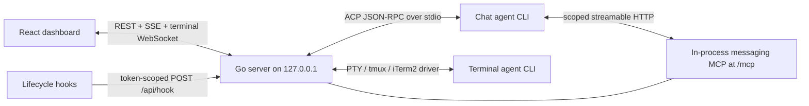
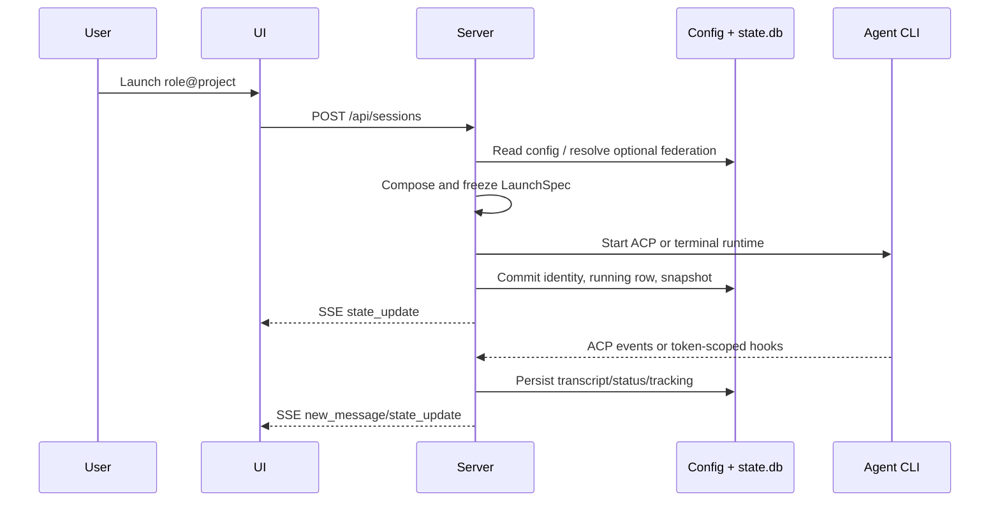

# AgentDeck architecture flow

Descriptive orientation only. Binding boundaries, protocols, data rules, and security constraints
live in [TS-01](docs/specs/tech/TS-01-architecture.md),
[TS-02](docs/specs/tech/TS-02-data-persistence.md),
[TS-03](docs/specs/tech/TS-03-http-api.md),
[TS-04](docs/specs/tech/TS-04-integration-protocols.md), and
[TS-05](docs/specs/tech/TS-05-security.md).

## Runtime topology



Launch composition may create registration artifacts for terminal agents, but the interactive
runtime does not consume them and recipient resolution/nudging excludes terminal agents. Host/Origin validation
wraps every browser-accessible route; hook and MCP producers use per-launch tokens. The remaining
same-machine API is intentionally unauthenticated (TS-05.R3).

## Launch, state, and UI flow



Launch, resume, and switch share the same composition and registration rules. Authoritative status
and identity mutations commit before their SSE publication; transcript events follow append-then-
publish on the successful path. SSE reconnect starts with a snapshot/hydration boundary.

## Data authority

```text
AgentDeck JSON config     human/server edited, atomic owner-only files
Native Claude/Codex      provider input when linked/mirrored; composed by TS-07 precedence
state.db                 server-sole-writer identity, runtime state, messages, index
transcript.ndjson        AgentDeck normalized append-only chat history
mirror/effective views   redacted, regenerable federation projections
```

See [the spec index](docs/specs/README.md) for feature ownership and acceptance criteria. The
pre-SDD long-form diagram is preserved in `docs/archive/snapshots/architecture-flow-pre-sdd.md`.
